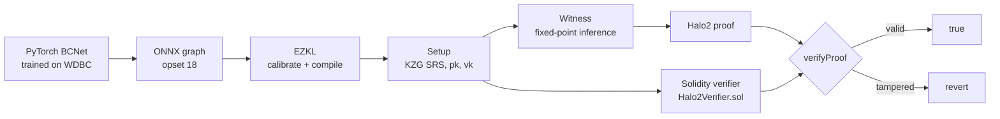

# VeriDx

[](https://github.com/rasyidred/veridx/actions/workflows/test.yml)

**Verifiable AI diagnosis with zero-knowledge proofs.**

A PyTorch breast-cancer classifier is compiled into a Halo2 circuit with [EZKL](https://github.com/zkonduit/ezkl), proven locally, and verified on-chain by a generated Solidity verifier. Anyone can check that a diagnosis came from the committed model, without trusting whoever ran it and without seeing the weights.

## Why

An AI diagnosis is only as trustworthy as the party running the model. They could swap in a different model, edit the output, or skip inference altogether. VeriDx removes that trust assumption: a proof shows that *this exact model* produced *this output* for *this input*, and an Ethereum smart contract checks it.

## How it works



1. **Train**: a 3-layer MLP classifies tumors as malignant or benign from 30 features (Wisconsin Diagnostic Breast Cancer dataset).
2. **Export**: the model is exported to ONNX, a fixed graph of `Gemm → Relu → Gemm → Relu → Gemm → Sigmoid`.
3. **Circuit**: EZKL calibrates fixed-point scales on real data and compiles the graph into a Halo2 circuit. The weights are baked in as constants.
4. **Prove**: EZKL runs inference inside the circuit and produces a proof, with the patient features and the prediction as public inputs.
5. **Verify on-chain**: EZKL generates a Solidity verifier, which is deployed with Foundry and called with the proof.

## Results

| Metric | Value |
|---|---|
| Model | MLP 30 → 64 → 32 → 1, 4,097 parameters |
| Test accuracy | 98.2% on 114 held-out patients |
| Circuit | input/param scale 11, logrows 18 (2^18 rows) |
| Float vs circuit output | 0.000489 vs 0.000488 (1/2048, one quantization step) |
| Proving | ~9 s, proof 25 KB (proving key 1.3 GB, verifying key 0.6 MB) |
| Local verification | ~0.1 s |
| On-chain verifier | 15,194 B runtime (under the 24,576 B EIP-170 limit) |
| On-chain verification cost | ~639k gas |
| Tamper test | modified output in calldata → verifier reverts |

## Design decisions

- **Public inputs and output, `fixed` weights.** The weights are compiled into the circuit, so the verifying key, and therefore the deployed verifier, commits to this exact model without publishing it. Private weights without a commitment would let a prover invent weights that produce any output.
- **Calibration on 50 real samples, not one.** Calibrating on a single patient returned a failure with a lookup range far too narrow for other patients. 50 training rows gave a range that covers real inputs at scale 11.
- **Opset 18.** EZKL's ONNX engine (tract) is tested up to opset 18, so the export is pinned there.
- **Inference only.** The proof covers the forward pass; training is out of scope.

## Limitations and next steps

- **Feature scaling happens outside the circuit.** The proof starts from standardized features, so it doesn't prove that the raw measurements were scaled correctly. Folding the scaler into the first layer would close this gap, at some cost in precision.
- **Sigmoid is inside the circuit.** It's a lookup-based op. Exporting logits and thresholding outside the circuit would make the circuit cheaper.
- **Inputs are public.** Real medical data would use `hashed` or `private` input visibility.
- **Local chain only.** Verified on Anvil; a testnet deployment is next.
- **Training isn't seeded**, so rerunning the notebook yields a new model and requires regenerating every artifact.

## Quickstart

Requirements: [uv](https://docs.astral.sh/uv/), Python 3.14, and [Foundry](https://getfoundry.sh/) for the on-chain part. Developed on Windows 11 with an NVIDIA GPU (training only; proving runs on CPU).

```powershell
git clone https://github.com/rasyidred/veridx.git
cd veridx
uv sync
uv run jupyter lab
```

**Quick check (no Python needed):** the committed proof is verified by a Foundry test, including a tampered-output case that must revert.

```powershell
cd contracts
forge test
```

**Full pipeline:** open `main.ipynb` and run it top to bottom:

| Phase | What it does |
|---|---|
| 1.5 | Load data, train and evaluate BCNet |
| 2 | Export to ONNX, write `input.json` |
| 3 | EZKL settings, calibration, compile, SRS, keys, witness, proof, local verify |
| 4 | Generate `Verifier.sol`, build with Foundry, deploy to Anvil, verify on-chain, tamper test |

Notes:
- The proving key (~1.3 GB) isn't committed; Phase 3 regenerates it.
- On Windows, EZKL needs the `HOME` environment variable. The notebook sets it with `os.environ.setdefault("HOME", os.path.expanduser("~"))` before the SRS step.
- The verifier compiles with `optimizer = true` (set in `contracts/foundry.toml`); without it, solc fails with "Stack too deep".

## Repository layout

```
main.ipynb        end-to-end pipeline: training → ONNX → proof → on-chain verification
artifacts/        generated files: network.onnx, settings.json, proof.json, Verifier.sol, ...
contracts/        Foundry project: verifier + tests (valid proof, tampered output)
```

## Tech stack

PyTorch · scikit-learn · ONNX · EZKL (Halo2, KZG) · Solidity · Foundry · uv
